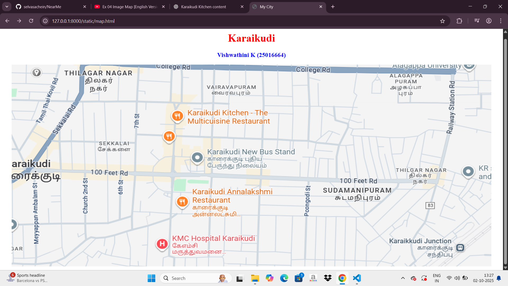
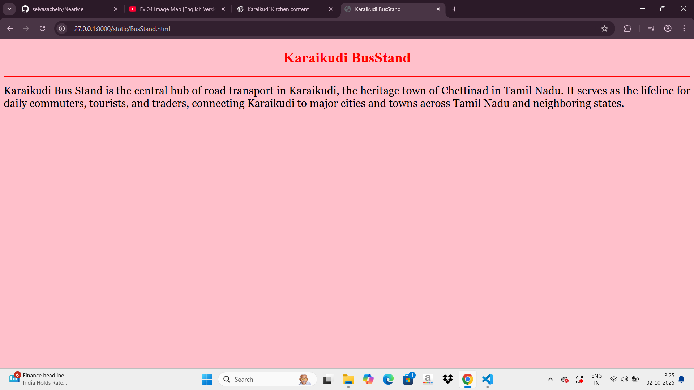
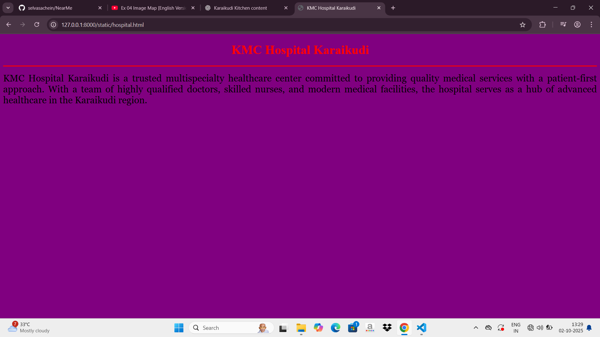
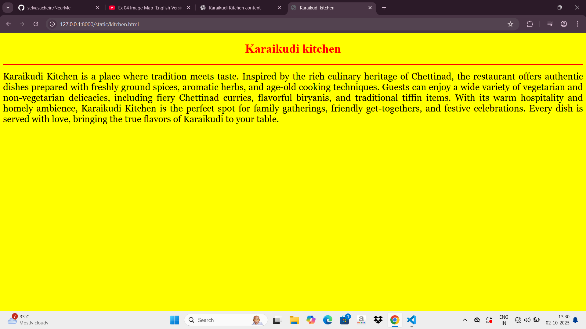
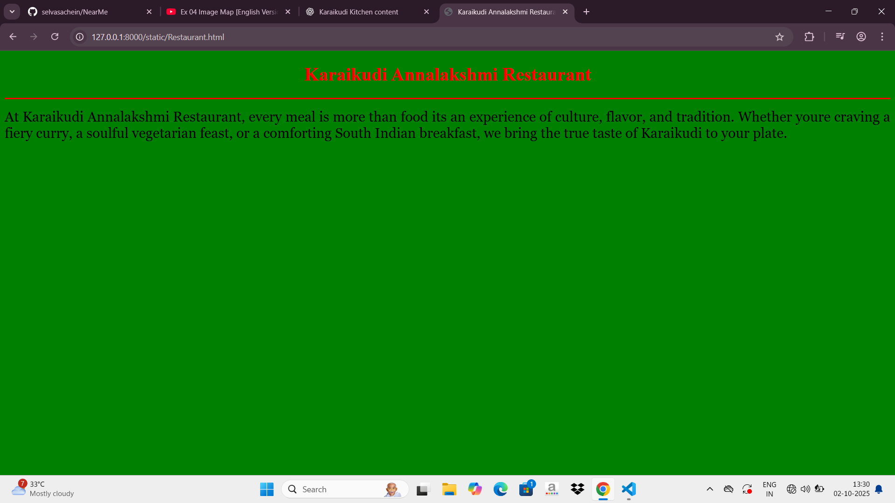
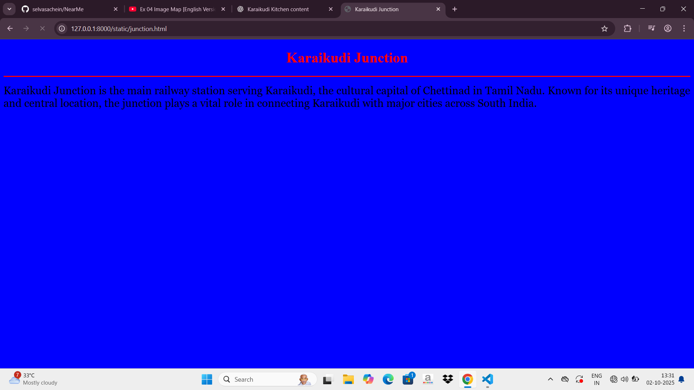

# Ex04 Places Around Me
## Date: 02-10-2025

## AIM
To develop a website to display details about the places around my house.

## DESIGN STEPS

### STEP 1
Create a Django admin interface.

### STEP 2
Download your city map from Google.

### STEP 3
Using ```<map>``` tag name the map.

### STEP 4
Create clickable regions in the image using ```<area>``` tag.

### STEP 5
Write HTML programs for all the regions identified.

### STEP 6
Execute the programs and publish them.

## CODE

```

map.html

<!DOCTYPE html>
<html>
<head>
    <title>My City</title>
</head>
<body>
    <h1 align="center">
        <font color="red"><b>Karaikudi</b></font>
    </h1>
    <h3 align="center">
        <font color="blue"><b>Vishwathini K (25016664)</b></font>
    </h3>
    <center>
        
        <map name="MyCity">
            
            <area shape="circle" coords="570,230,45" href="kitchen.html" title="Karaikudi kitchen">
            <area shape="circle" coords="640,200,30" href="Restaurant.html" title="Karaikudi Annalakshmi Restaurant">
            <area shape="circle" coords="100,200,300" href="Hospital.html" title="KMC Hospital Karaikudi">
            <area shape="rect" coords="650,250,35" href="Junction.html" title="Karaikudi Junction">
            <area shape="rect" coords="650,250,35" href="BusStand.html" title="Karaikudi Junction">
        </map>
    </center>
</body>
</html>

BusStand.html

<!DOCTYPE html>
<html>
<head>
    <title>Karaikudi BusStand</title>
</head>
<body bgcolor="pink">

    <h1 align="center">
        <font color="red"><b>Karaikudi BusStand</b></font>
    </h1>
    

    <h3 align="center">
        <font color="blue"><b></b></font>
    </h3>

    <hr size="3" color="red">

    <p align="justify">
        <font face="Georgia" size="5">
        Karaikudi Bus Stand is the central hub of road transport in Karaikudi, the heritage town of Chettinad in Tamil Nadu. It serves as the lifeline for daily commuters, tourists, and traders, connecting Karaikudi to major cities and towns across Tamil Nadu and neighboring states.
        </font>
    </p>

</body>
</html>

Hospital.html

<!DOCTYPE html>
<html>
<head>
    <title>KMC Hospital Karaikudi</title>
</head>
<body bgcolor="Purple">

    <h1 align="center">
        <font color="red"><b>KMC Hospital Karaikudi</b></font>
    </h1>
    

    <h3 align="center">
        <font color="blue"><b></b></font>
    </h3>

    <hr size="3" color="red">

    <p align="justify">
        <font face="Georgia" size="5">
        KMC Hospital Karaikudi is a trusted multispecialty healthcare center committed to providing quality medical services with a patient-first approach. With a team of highly qualified doctors, skilled nurses, and modern medical facilities, the hospital serves as a hub of advanced healthcare in the Karaikudi region.
        </font>
    </p>

</body>
</html>

Junction.html


<!DOCTYPE html>
<html>
<head>
    <title>Karaikudi Junction</title>
</head>
<body bgcolor="blue">

    <h1 align="center">
        <font color="red"><b>Karaikudi Junction</b></font>
    </h1>
    

    <h3 align="center">
        <font color="blue"><b></b></font>
    </h3>

    <hr size="3" color="red">

    <p align="justify">
        <font face="Georgia" size="5">
        Karaikudi Junction is the main railway station serving Karaikudi, the cultural capital of Chettinad in Tamil Nadu. Known for its unique heritage and central location, the junction plays a vital role in connecting Karaikudi with major cities across South India.        </font>
    </p>

</body>
</html>

Kitchen.html

<!DOCTYPE html>
<html>
<head>
    <title>Karaikudi kitchen</title>
</head>
<body bgcolor="yellow">

    <h1 align="center">
        <font color="red"><b>Karaikudi kitchen</b></font>
    </h1>
    

    <h3 align="center">
        <font color="blue"><b></b></font>
    </h3>

    <hr size="3" color="red">

    <p align="justify">
        <font face="Georgia" size="5">
        Karaikudi Kitchen is a place where tradition meets taste. 
        Inspired by the rich culinary heritage of Chettinad, 
        the restaurant offers authentic dishes prepared with freshly ground spices, 
        aromatic herbs, and age-old cooking techniques. 
        Guests can enjoy a wide variety of vegetarian and non-vegetarian delicacies, 
        including fiery Chettinad curries, flavorful biryanis, and traditional tiffin items. 
        With its warm hospitality and homely ambience, Karaikudi Kitchen is the perfect spot 
        for family gatherings, friendly get-togethers, and festive celebrations. 
        Every dish is served with love, bringing the true flavors of Karaikudi to your table.
        </font>
    </p>

</body>
</html>

Restaurant.html

<!DOCTYPE html>
<html>
<head>
    <title>Karaikudi Annalakshmi Restaurant</title>
</head>
<body bgcolor="green">

    <h1 align="center">
        <font color="red"><b>Karaikudi Annalakshmi Restaurant</b></font>
    </h1>

    <h3 align="center">
        <font color="blue"><b></b></font>
    </h3>

    <hr size="3" color="red">

    <p align="justify">
        <font face="Georgia" size="5">
            At Karaikudi Annalakshmi Restaurant, every meal is more than food  its an experience of culture, flavor, and tradition. Whether youre craving a fiery curry, a soulful vegetarian feast, or a comforting South Indian breakfast, we bring the true taste of Karaikudi to your plate.
        </font>
    </p>

</body>
</html>


```

## OUTPUT








## RESULT
The program for implementing image maps using HTML is executed successfully.
